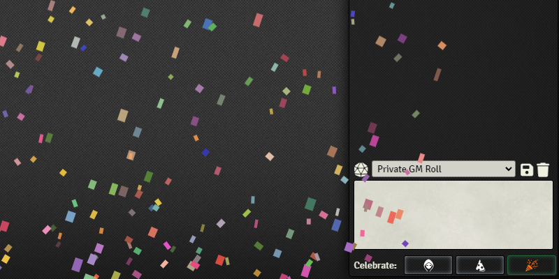

# Celebrate


[](https://ko-fi.com/elffriend)

## Celebrate the good times!

This module lets you shoot confetti with either some handy-dandy buttons on the chat sidebar or via provided macros. You can also configure the style and color choices of your confetti which will be synced to other players. Note that settings like scale, multipliers, or glitter color cycle deviations will _not_ be synced for the comfort of other players.

## Installation

Module JSON:

```
https://github.com/voodoofrog/foundryvtt-celebrate/releases/latest/download/module.json
```

## Screenshots



## Configuration

| **Name**                  | Description                                                                                                       |
| ------------------------- | ----------------------------------------------------------------------------------------------------------------- |
| GM Only                   | [WORLD SETTING] If your players are abusing the confetti, enable this and prevent them shooting it.               |
| Confetti Multiplier       | Multiplies the amount of confetti pieces fired. Set this high at your own peril!                                  |
| Confetti Scale            | How big you want your confetti pieces to be.                                                                      |
| Confetti Color Base       | Confetti will be colored with this as the base color.                                                             |
| Confetti Style Choice     | Default: Multi colored confetti.                                                                                  |
|                           | Base Color: Confetti with the chosen color above.                                                                 |
|                           | Glitter: Sparkly color cycling confetti.                                                                          |
|                           | Base Glitter: Glitter derived from the base color.                                                                |
| Glitter Color Deviation   | How much deviation from the starting color you want when the glitter pieces are color cycled.                     |
| Mute                      | Mutes the sound. Silence is golden?                                                                               |
| Fire Rate Limit (Seconds) | [WORLD SETTING] Starts a cooldown after each shot. Highly recommended!                                            |
| Show Button               | Disable if you are only interested in using it from macros/modules and/or the button conflicts with other things. |

## Compatibility

No known issues at this time, but if you spot any be sure to report it.

## API

After the hook `celebrateReady` is fired, the following api methods are expected to be on `window.confetti`:

### `confettiStrength`

a javascript object:

```js
const ConfettiStrength = {
  low: 0,
  med: 1,
  high: 2,
};
```

### `getShootConfettiProps(strength: (0 | 1 | 2))`

Returns the properties that `handleShootConfetti` and `shootConfetti` use based on the strength you feed it.

### `handleShootConfetti({ amount, ...shootConfettiProps }: ShootConfettiProps)`

Makes the appropriate amount of confetti fire on only the current user's screen.

### `Confetti.shootConfetti(shootConfettiProps: ShootConfettiProps)`

Makes the appropriate amount of confetti fire on all clients' screens.

### Example:

```js
function makeConfetti() {
  const strength = window.confetti.confettiStrength.low;
  const shootConfettiProps = window.confetti.getShootConfettiProps(strength);

  if (isSecretCelebration) {
    // I only want this to happen on my user's screen
    window.confetti.handleShootConfetti(shootConfettiProps);
  } else {
    // I want confetti on all connected users' screens
    window.confetti.shootConfetti(shootConfettiProps);
  }
}
```

## Known Issues

- Spamming the confetti buttons could cause serious slow down or crashes. That's what the Fire Limit is for.
- If you set the Confetti Multiplier to max, things could get dicey, but it largely depends on your machine.

## Acknowledgements

Sound Effects from [Zapsplat.com](https://www.zapsplat.com/).

This was originally forked from [Confetti](https://github.com/ElfFriend-DnD/foundryvtt-confetti) by ElfFriend-DnD so if you want to chuck some bones at anyone choose them not me. There's a badge above for it.

The template used to bootstrap this module is [template-svelte-esm](https://github.com/typhonjs-fvtt-demo/template-svelte-esm) by TyphonJs who also provided some help.
